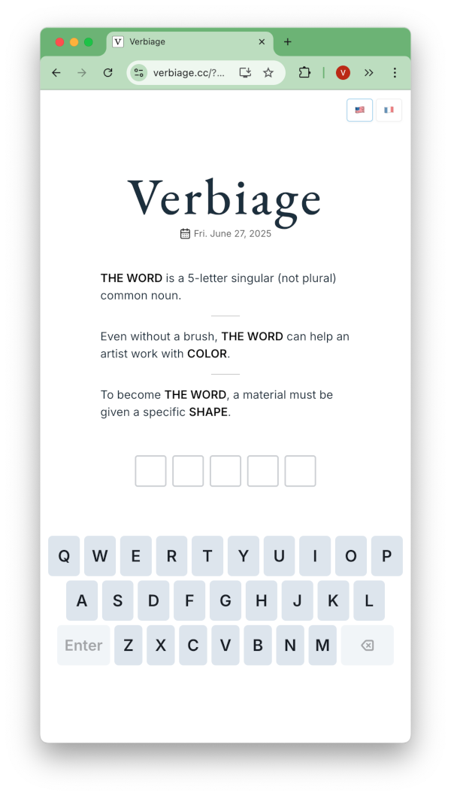

# Verbiage

Verbiage is a word guessing game. When you guess the wrong word, you get a clue about how your guess relates to the secret word.



## Repository

This repository is organized in two folders:

- `scripts` contains the scripts for generating the word lists and clues, and generating the daily puzzles.
- `verbiage` contains the code for the app.

### Scripts

The scripts can be used as follows (see `-h` for options):

```bash
# Compile the list of english words (4, 5, 6 letters)
python scripts/word_lists/en_words.py

# Play in the terminal
python scripts/game.py play --language en --word-size 5

# Run tests on predefined words
python scripts/game.py test --language fr
```

### Verbiage web app

The web app is built using SvelteJS and can be run locally with:

```bash
cd verbiage
npm install
npm run dev
```

The app deployed to [verbiage.cc](https://verbiage.cc) on each push to the `main` branch.

## Stack

Verbiage was built using
- <a
        href="https://deepmind.google/technologies/gemini/"
        target="_blank"
        rel="noopener noreferrer">Google Gemini</a
      > for AI-generated clues.
- <a
        href="http://www.lexique.org/databases/Lexique383/"
        target="_blank"
        rel="noopener noreferrer">Lexique383</a
      >, <a
        href="https://www.gutenberg.org/files/3203/files/mobypos.txt"
        target="_blank"
        rel="noopener noreferrer">mobypos</a
      >,  <a
        href="https://github.com/zaibacu/thesaurus"
        target="_blank"
        rel="noopener noreferrer">Zaibacus' thesaurus</a
      >, <a
        href="https://norvig.com/ngrams/"
        target="_blank"
        rel="noopener noreferrer">Peter Norvig's frequency list</a
      >, <a
        href="https://github.com/felixfischer/categorized-words"
        target="_blank"
        rel="noopener noreferrer">categorized-words</a
      >, for the lists of words.
- <a href="https://svelte.dev" target="_blank" rel="noopener noreferrer"
        >SvelteJS</a
      >, <a
        href="https://mattboldt.com/demos/typed-js/"
        target="_blank"
        rel="noopener noreferrer">Matt Boldt's Typed-JS</a
      >, <a href="https://animate.style/" target="_blank" rel="noopener noreferrer"
        >Animate.css</a
      >, <a
        href="https://github.com/kaisermann/svelte-i18n"
        target="_blank"
        rel="noopener noreferrer">svelte-i18n</a
      > for the website.